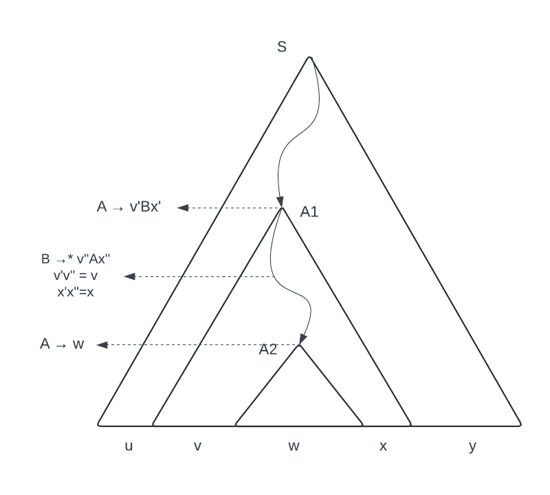

# Renaming non terminals
Lemma: let
$$G = (V,\ S,\ T,\ P)$$
then every grammar $G'$ obtained from $G$ by renaming its non terminals is such that $L(G) = L(G')$

# Cleaning up free grammars
Lemma: let $L$ be a context free language. There exists a context-free grammar $$G\ | \ L(G) = L\setminus {\varepsilon}$$
that has:
+ no $\varepsilon$-productions:  productions in the shape of $A\rightarrow \varepsilon$
+ no unit production: productions in the shape of $A\rightarrow B$
+ no non-terminals that never appear in derivations of some strings of terminals

In order to clean up a free grammar we have to:
+ Find all **nullable** non terminals, this means every non terminal $A | A\Rightarrow^*\ \varepsilon$. The $\Rightarrow^*$ operator is used to indicate all non terminals that can produce the terminal on the right in any number of steps
+ Substitute each production $A\rightarrow Y_1 Y_2 \dots Y_n$ by a family of productions where combinations of nullable $Y_i$ are removed from the body (i.e. if we have a production $S \rightarrow ABC$, with B and C nullable, we're gonna rewrite that production as $S \rightarrow ABC\ |\ AB \ |\ AC\ |\ A$, where each nullable non terminal "takes a turn" to be eliminated)
+ Eliminate every production $A\rightarrow \varepsilon$ 

## Example of cleaning up free grammars
Original grammar:
$$\begin{align}
& S \rightarrow ABC\ |\ abc \\
& A \rightarrow aB\ |\ \varepsilon\\
& B \rightarrow bA\ |\ C\\
& C \rightarrow \varepsilon \\
\end{align}$$
First, we find all nullable non terminals
+ A and C are nullable by $A \rightarrow \varepsilon$ and $C \rightarrow \varepsilon$
+ B is nullable by $B \rightarrow C \rightarrow \varepsilon$
+ S is nullable by $S \rightarrow ABC$ and A, B, and C are nullable
 
 Then we substitute each production $A\rightarrow Y_1 Y_2 \dots Y_n$ by a family of productions where each combination of nullable $Y_i$ takes turn to be eliminated
 $$\begin{align}
& S \rightarrow ABC\ |\ abc\ |\ AB \ |\ AC \ |\ BC \ |\ A \ |\ B \ |\ C \\
& A \rightarrow aB\ |\ a \ |\ \varepsilon\\
& B \rightarrow bA\ |\ b \ |\ C\\
& C \rightarrow \varepsilon \\
\end{align}$$

We then eliminate every production $A\rightarrow \varepsilon$
$$\begin{align}
& S \rightarrow ABC\ |\ abc\ |\ AB \ |\ AC \ |\ BC \ |\ A \ |\ B \ |\ C \\
& A \rightarrow aB\ |\ a \\
& B \rightarrow bA\ |\ b \ |\ C\\
\end{align}$$
C is now useless, as it does not appear in any derivation, we can eliminate all the productions with it:
$$\begin{align}
& S \rightarrow abc\ |\ AB \ |\ A \ |\ B\\
& A \rightarrow aB\ |\ a \\
& B \rightarrow bA\ |\ b\\
\end{align}$$
For the last step, we eliminate all the unit productions ($A \rightarrow B$) by substituting the right hand side with all the productions of that non terminal
$$\begin{align}
& S \rightarrow abc\ |\ AB \ |\ aB\ |\ a  \ |\ bA\ |\ b\\
& A \rightarrow aB\ |\ a \\
& B \rightarrow bA\ |\ b\\
\end{align}$$

# Closure with reference to union
Lemma: the class of free languages is closed w.r.t. set union
Proof: TODO, it has to do with renaming the initial states of the two to $S_1$ and $S_2$, then adding a new staring state and the production $S \rightarrow S_1\ |\ S_2$

# Closure with reference to concatenation
Lemma: the class of free languages is closed w.r.t. language concatenation
Proof: TODO, it has to do with renaming the initial states of the two to $S_1$ and $S_2$, then adding a new staring state and the production $S \rightarrow S_1S_2$ 

# Closure with reference to intersection
Free languages are **not** closed w.r.t. intersection

# Pumping lemma for free languages
Let $L$ be a free language, then
$$\begin{gather*}
\exists  p \in \mathbb{N}^+\\
\forall z \in L : |z|> p \\ 
\exists \ u,v,w, x, y \ :\ z=uvwxy,\ |vwx|\le p,\ |vx| \gt 0, \\
\forall i \in \mathbb{N}\ uv^iwx^iy \in L
\end{gather*}$$
This is a mess, but it's saying this: there exists a certain threshold p such that all strings z longer than p produced by the grammar L can be split into 5 parts ($uvwxy$), these 5 parts have the following properties:
+ the length of $vwx \le p$ (the middle part has an upper limit to its size)
+ the length of $vx \gt 0$ (at least one of them is not an empty string)
+ $uvwxy$ is in the language, so is $uvvwxxy$, and $uvvvvwxxxxy$ 
## Proof and explanation of where the fuck that garbage came from

Let $L$ be a free language, the lemma is about words longer than a certain p we get to choose, so we can always choose $P\gt 0$ and exclude the language that produces $\varepsilon$.
We also consider a cleaned up free grammar $G$ such that $L(G) = L \setminus \{\varepsilon\}$

1) Firstly, we transform G into [[Chomsky's normal form]] and call it $G'$.
2) Let k be the number of non terminals in $G'$
3) Observe that any derivation tree for words in $L(G')$ has
	+ $2^0$ nodes at level $0$
	+ at most $2^1$  nodes at level $1$
	+ at most $2^2$ nodes at level $2$
	+ $\dots$
	+ at most $2^j$ nodes at level $j$
4) Consider $p=2^{k+1}$ 
5) Consider $z \in L : |z|\gt p$
6) Then the derivation tree for $z$ must have at least $k+2$ levels, this means that the longest path of the derivation tree for z has at least $k+1$ non terminals, since $k$ was chosen to be the same as the number of non terminals, then there is at least one non terminal that is repeated at least twice in the derivation path
7) Consider the longest path in the tree, and the deepest pair of occurrences of the same non terminal: the non terminal whose second occurrence is found first while searching the tree from the bottom to the top, let that non terminal be $A$, and call its two occurrences $A_1$ and $A_2$ , with $A_2$ being the lowest
8) Then $z=uvwxy$, where 
	+ $u$ and $y$ are the beginning and end of $z$ (as in the beginning of $u$ is the beginning of $z$, and the end of $u$ is the end of $y$)
	+ $v$ and $x$ are the beginning and end of the string derived from $A_1$
	+ $w$ is the string derived from $A_2$

(small mistake in image: x''x' = x, (the x' and x'' are swapped), not gonna bother fixing it)
9) From this we can tell that:
	+ $\forall i \in \mathbb{N}\ uv^iwx^i \in L$ because:
		+ $uv^0wx^0y = uwy \in L$: since $A_2$ can produce a string $w$, then so can $A_1$, as they are the same non terminal
		+ $uv^1wx^1y = uvwxy \in L$: this is the definition of $z$ which we picked as $\in L$ so there is not much to say
		+ $uv^2wx^2y \in L$: we can derive this by applying whichever rules we followed to go from $A_1$ to $A_2$ again after we get to $A_2$ (they are both the same non terminal so they have the same rules), until we get to the non terminal again (let's call it $A_3$), we can now apply the same rules we had applied to $A_2$ to get $w$ to $A_3$, and it will give the same $w$, since (for the last time) they are the same non terminal
		+ $\forall i \in \mathbb{N}\ uv^iwx^i \in L$ as we can apply the last idea as many times as we want (i.e. deriving an $A_4$ from $A_3$, and $A_5$ from $A_4$, and then deriving $w$ from $A_5$ will give us the string $uv^5wx^5y$ )
	+ $|vwx| \lt p$ because we have chosen the deepest pair of repeated non terminals $A_1$ and $A_2$ along the longest path from $S$, this means that along the longest path starting from $A_2$, no non terminal can occur more than once, meaning that the subtree rooted in $A_2$ has at most k+1 levels, meaning that the length of the strings produced by the subtree is limited by $2^k+1$, this point is valid as we had chosen $p=2^{k+1}$ at step 4
	+ $|vx| > 0$ as $G'$ is cleaned up, then there cannot be any unit production such as $A\Rightarrow ^+ A$, there has to be at least one terminal either before or after $A$
## Why do we need this garbage
It can be used to show that a language is not free, the idea is to assume that it is, show that the thesis of the lemma is false, and then prove the opposite, this concludes that a language is not free by contradiction. It cannot be used to show that a language is free, as it doesn't tell us anything about properties of non free language, so a language might not be free but still match all the thesis of the pumping lemma

## Additional notes
Any finite language is regular, as we can build a finite automaton to recognize them. The pumping lemma is vacuously true for any finite language, since it talks about all strings longer than a certain p, we can choose p as "length of the longest word"+1, and there are no strings to be pumped